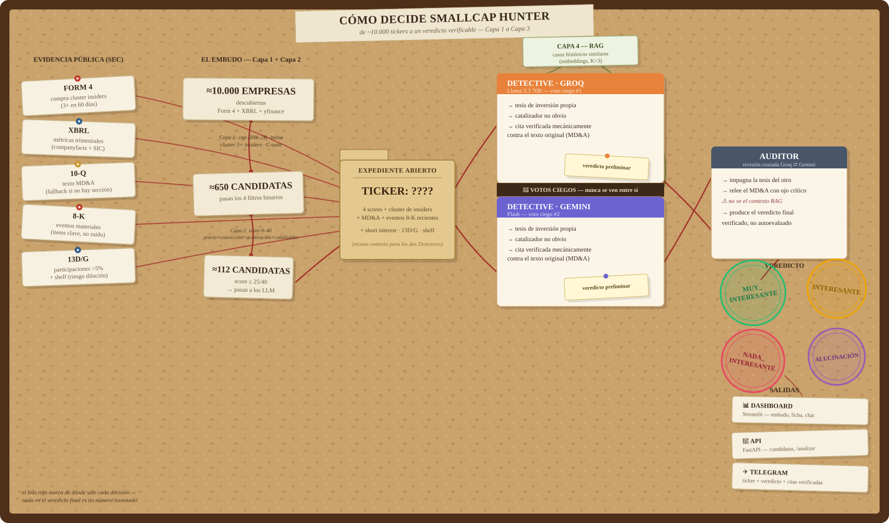

# SmallCap Hunter

[](https://github.com/Guille6520/SmallcapHunter/actions/workflows/tests.yml)

[](LICENSE)

Sistema autónomo de detección de small caps americanas en fase pre-explosiva.
Busca empresas que muestran el patrón que tuvieron Amazon, Netflix o Tesla
6-12 trimestres antes de despegar: aceleración del crecimiento, mejora de
márgenes e insiders comprando en cluster — usando datos públicos de la SEC.

Filosofía del sistema: precisión sobre recall. El objetivo no es puntuar
miles de empresas, es producir 3-8 alertas reales al año. Los números
filtran primero (barato); los LLMs solo analizan a las supervivientes.

Proyecto final del Bootcamp IA Fullstack — KeepCoding 2026.

> **Aviso.** Esto es un proyecto de portafolio sobre datos públicos de la
> SEC, no un producto financiero. Los veredictos (`MUY_INTERESANTE`,
> `INTERESANTE`...) son un nivel de interés para investigación propia,
> nunca una recomendación de inversión. Ningún LLM debería decidir dónde
> pones tu dinero — y menos uno gratuito con cuota de 20 llamadas al día.

---

## Arquitectura



---

## Requisitos previos

- Python 3.11+
- Docker Desktop
- Cuenta gratuita en [Groq](https://console.groq.com) (Llama 3.3 70B)
- Cuenta gratuita en [Google AI Studio](https://aistudio.google.com) (Gemini Flash)

---

## Instalación

### 1. Clona el repositorio

```bash
git clone https://github.com/Guille6520/SmallcapHunter.git
cd SmallcapHunter
```

### 2. Instala las dependencias

```bash
pip install -r requirements.txt
```

### 3. Levanta PostgreSQL con pgvector

```bash
docker run -d --name smallcap_hunter_db \
  -e POSTGRES_PASSWORD=tu_password \
  -e POSTGRES_DB=smallcap_hunter \
  -p 5434:5432 \
  pgvector/pgvector:pg16
```

Aplica el schema:

```bash
# Linux / Mac
docker exec -i smallcap_hunter_db psql -U postgres -d smallcap_hunter < schema.sql

# Windows PowerShell (la redirección < no funciona en PowerShell)
Get-Content schema.sql | docker exec -i smallcap_hunter_db psql -U postgres -d smallcap_hunter
```

### 4. Variables de entorno

Copia `.env.example` como `.env` y rellena los valores. Todos los
scripts lo cargan automáticamente al arrancar (python-dotenv) — no hace
falta definir nada en el terminal.

```
DB_HOST=127.0.0.1        # en Windows con Docker Desktop, NO usar "localhost"
DB_PORT=5434
DB_NAME=smallcap_hunter
DB_USER=postgres
DB_PASSWORD=tu_password
GROQ_API_KEY=...
GEMINI_API_KEY=...
SEC_CONTACT_EMAIL=tu_email_real@dominio.com   # la SEC lo exige en el User-Agent
```


---

## Uso

### Ingesta de datos

```bash
# 1. Carga el histórico de Form 4 (compras de insiders) desde la SEC
python loader_backfill.py --desde 2015 --hasta 2026

# 2. Enriquece cada empresa con métricas trimestrales XBRL
python enriquecedor_xbrl.py

# 3. Descarga datos de mercado (market cap, rango 52 semanas, bolsa)
python mercado_yfinance.py
```

### Capa 4 — RAG (embeddings)

Tras traer el texto (MD&A vía `ingesta_10q.py`, eventos vía `ingesta_8k.py`),
genera los embeddings pendientes con Gemini (`gemini-embedding-001`, 1536
dims para encajar en el índice `ivfflat` del schema):

```bash
python generar_embeddings_rag.py
```

Sin este paso, el Detective funciona exactamente igual pero sin el bloque
de "casos históricos similares" — es opcional por diseño (ver
`detective.buscar_casos_similares_rag`), no una dependencia dura.

### Pipeline de análisis

```bash
# Capa 1: filtros binarios (tamaño, bolsa, cluster buying, C-suite)
python filtro_capa1.py

# Capa 2: scoring numérico 0-40 (precio, convicción, aceleración, catalizador)
python scorer_capa2.py

# Texto MD&A del 10-Q más reciente para las candidatas finales
python ingesta_10q.py

# Eventos materiales (8-K) de los últimos 12 meses de las candidatas:
# contratos, cambios de directivos, ampliaciones — lo que pasa ENTRE
# trimestres. Solo los items relevantes (tabla configuracion), el resto
# del 8-K es ruido administrativo
python ingesta_8k.py

# Participaciones >5% (13D/G — la versión institucional del cluster) y
# detección de shelf registrations S-3/424B (riesgo de dilución)
python ingesta_13dg.py

# Capa 3: agentes LLM con verificación determinista de citas.
# Recomendado — el grafo de LangGraph hace las tres cosas de golpe:
# los dos Detectives en paralelo (fan-out) + el Auditor cruzado en
# cuanto ambos terminan (fan-in). Es lo mismo que las tres líneas de
# abajo, pero como un solo comando (y es lo que usa orquestador.py):
python grafo_capa3.py --ticker XXXX

# Manual, modelo por modelo (para depurar uno solo):
python detective.py --ticker XXXX --modelo groq
python detective.py --ticker XXXX --modelo gemini
python auditor.py --ticker XXXX     # audita cruzado: Groq revisa a Gemini y viceversa
```

### Modo autónomo (orquestador)

Todo lo anterior encadenado, con los agentes analizando SOLO empresas
con datos nuevos desde su último análisis, y tope + pausas para las
cuotas gratuitas de Groq/Gemini:

```bash
python orquestador.py             # una pasada completa
python orquestador.py --daemon    # una pasada cada 48h (scheduler_horas)
```

Si `TELEGRAM_BOT_TOKEN` y `TELEGRAM_CHAT_ID` están configurados, cada
análisis del Detective o el Auditor manda un aviso a tu Telegram con el
ticker, el veredicto y las citas verificadas. Sin configurar, todo
funciona igual — el aviso es cortesía, no dependencia.

### Dashboard

```bash
streamlit run dashboard.py
```

Tres vistas: el embudo completo con el ranking de candidatas, la ficha
de cada empresa (scores, insiders, revenue, MD&A, veredictos), y un
chat con LLM que ve el mismo contexto que el Detective para conversar
sobre cualquier candidata.

### API (FastAPI)

Segunda interfaz sobre los mismos datos, para consumo por programa en vez
de por un humano en el navegador — reutiliza la misma capa de acceso a
datos que el dashboard y el Detective, no duplica consultas:

```bash
uvicorn api:app --reload --port 8000
```

Documentación interactiva (Swagger) en `http://127.0.0.1:8000/docs`.
Endpoints: `GET /candidatas`, `GET /candidatas/{ticker}`,
`GET /candidatas/{ticker}/similares` (Capa 4 — RAG expuesto directamente),
`POST /candidatas/{ticker}/analizar` (dispara la Capa 3 completa vía el
grafo de LangGraph, en proceso).

### Tests

```bash
pip install -r requirements.txt
pytest
```

La suite (`tests/`) es toda offline — sin BD, sin API keys, sin red — así
que corre igual en tu máquina que en CI (ver el badge arriba). Cubre la
lógica pura del pipeline (normalización, filtros, scoring, regex del
MD&A), el verificador de citas, la degradación del RAG cuando no hay
embeddings o falla la API, la orquestación del grafo de LangGraph
(fan-out/fan-in, qué pasa si un modelo falla) y los endpoints de la API.

Los scripts de validación histórica (`validacion_historica.py`,
`backtest_rendimiento.py`, `validacion_recall_ganadoras.py`...) NO están
en `tests/` a propósito: tardan 30-60 min, necesitan red y Postgres, y
miden si la hipótesis del sistema se sostiene contra datos reales — es
otra cosa que un test unitario. Ver la sección de abajo.

### Validación histórica de la hipótesis

Scripts de solo lectura que comprueban la hipótesis contra datos reales:

```bash
# ¿Qué empresas tuvieron alguna vez la señal exacta que busco?
python descubrir_clusters_historicos.py

# ¿Cuáles eran de verdad small caps EN ESE MOMENTO? (market cap histórico,
# sin look-ahead bias) — genera validadas_historicas.csv
python validacion_historica.py

# Corpus de 10-Q DE LA ÉPOCA de cada cluster, para el RAG
python ingesta_10q_historico.py --muestra 40

# ¿La señal batió al Russell 2000 a 12 y 24 meses?
python backtest_rendimiento.py

# Recall: de las ganadoras reales de mi ventana de datos, ¿cuántas
# mostraron el cluster ANTES de subir? (~30-60 min, usa yfinance)
python validacion_recall_ganadoras.py --limite 50
```

---

## Estructura del proyecto

```
smallcap_hunter/
├── schema.sql                        # PostgreSQL 16 + pgvector
├── requirements.txt
├── pytest.ini
├── LICENSE
├── normalizar.py                     # reglas únicas de limpieza de datos
│
│   # Ingesta
├── loader_backfill.py                # Form 4 (ZIPs trimestrales de la SEC)
├── enriquecedor_xbrl.py              # métricas trimestrales (companyfacts + SIC)
├── mercado_yfinance.py               # market cap, precio, rango 52w, bolsa
├── ingesta_10q.py                    # texto MD&A del 10-Q (para la Capa 3)
├── ingesta_8k.py                     # eventos materiales 8-K por item (para la Capa 3)
├── ingesta_13dg.py                   # participaciones >5% + detección de shelf
├── orquestador.py                    # el pipeline completo corriendo solo (48h)
│
│   # Pipeline
├── filtro_capa1.py                   # 4 filtros binarios de descarte
├── scorer_capa2.py                   # 4 sub-scores numéricos (0-40)
├── detective.py                      # agente LLM: tesis + citas verificables + RAG (Capa 4)
├── auditor.py                        # agente LLM cruzado que impugna la tesis
├── grafo_capa3.py                    # Detective(s) + Auditor como grafo de LangGraph
│
│   # Capa 4 — RAG
├── embeddings.py                     # wrapper de gemini-embedding-001
├── generar_embeddings_rag.py         # backfill de metricas_trimestrales/eventos_8k.embedding
│
│   # Interfaz y alertas
├── dashboard.py                      # Streamlit: embudo, fichas y chat LLM
├── api.py                            # FastAPI: candidatas, ficha, RAG, disparar análisis
├── notificador_telegram.py           # aviso por Telegram tras cada análisis
│
│   # Tests (offline, ver .github/workflows/tests.yml)
├── tests/
│   ├── conftest.py
│   ├── test_pipeline_offline.py      # normalización, filtros, scoring, regex, citas
│   ├── test_rag_retrieval.py         # RAG y su degradación elegante
│   ├── test_grafo_capa3.py           # orquestación LangGraph (fan-out/fan-in)
│   └── test_api.py                   # endpoints de FastAPI
│
│   # Validación (solo lectura, no toca producción — no son tests unitarios)
├── descubrir_clusters_historicos.py
├── validacion_historica.py
├── ingesta_10q_historico.py
├── backtest_rendimiento.py
├── validacion_recall_ganadoras.py
└── validadas_historicas.csv          # generado por validacion_historica.py
```

---

## Pipeline

```
Form 4 + XBRL (SEC) + yfinance
      ↓   ~10.000 empresas descubiertas
Capa 1: filtros binarios (market cap 50M-2B, bolsa, cluster 3+ insiders/60d, C-suite)
      ↓   ~650 candidatas
Capa 2: scoring numérico (precio 52W + convicción + aceleración + catalizador)
      ↓   ~112 candidatas (score ≥ 25/40, configurable en la tabla configuracion —
          corte deliberadamente ancho: el embudo fino lo hacen los agentes)
Capa 3: Detective → Auditor cruzado (Groq/Llama 3.3 y Gemini Flash, votos ciegos),
        orquestados como un grafo de LangGraph (grafo_capa3.py: fan-out a
        los dos Detectives, fan-in al Auditor cruzado)
        con el MD&A del 10-Q + eventos 8-K + señales de mercado (short
        interest, shelf registrations, 13D/G) + Capa 4 (RAG: casos
        históricos semánticamente similares) como contexto,
        + verificador determinista de citas contra los textos originales
      ↓
Veredicto de interés (no es consejo de inversión):
  MUY_INTERESANTE / INTERESANTE / NADA_INTERESANTE / ALUCINACION
```

Dos interfaces sobre el mismo dato: `dashboard.py` (Streamlit, para un
humano) y `api.py` (FastAPI, para consumo por programa).

---

## Qué queda pendiente incluso dentro de lo ya implementado

Honestidad ante todo: RAG, LangGraph y FastAPI existen y funcionan (ver
`tests/`), pero con límites concretos que no escondo:

- **El Auditor no ve el contexto RAG** — `buscar_casos_similares_rag` solo
  se llama desde `detective.py`. El Auditor relee el MD&A con ojo crítico
  pero no recibe los casos históricos similares que sí ve el Detective.
- **El corpus RAG empieza vacío** — hay que correr
  `generar_embeddings_rag.py` explícitamente tras la ingesta de texto;
  sin eso, `buscar_casos_similares_rag` devuelve `[]` y el Detective
  funciona exactamente igual que antes de la Capa 4 (degradación
  elegante a propósito, no un fallo silencioso).
- **El grafo de LangGraph es secuencial dentro de cada nodo** — el
  fan-out/fan-in reemplaza la orquestación manual, pero no paraleliza
  con hilos/async; para dos llamadas HTTP a APIs distintas (Groq/Gemini)
  esto es aceptable, no lo sería con una carga mucho mayor.
- **La API es síncrona y sin cola de tareas** — `POST
  /candidatas/{ticker}/analizar` bloquea 10-30s (dos LLMs + verificador
  de citas). Correcto para el volumen real del proyecto, no para un
  servicio con muchos usuarios concurrentes.

## Roadmap (pendiente, en orden de prioridad)

- **Filtro de compra cosmética** — los datos ya están (Item 3.02 del 8-K
  y `shelf_activa` del 13D/G); falta convertirlos en filtro duro de
  Capa 1 en vez de solo contexto para los agentes
- **Ratio de convicción real** — importe / compensación anual del insider
  (necesita parsear el DEF 14A, tablas HTML de compensaciones)
- **Adopción de mercado (Capa 4)** — Google Trends como proxy gratuito de
  si el producto despega en el mundo real
- **Agente de monitoring (V2)** — guardián de noticias sobre las
  MUY_INTERESANTE: clasifica cada noticia como catalizador / ruido /
  tesis rota comparándola contra la tesis original del Detective
- **Módulo macro top-down (V2)** — perspectiva sectorial pre-digerida
  (tipos, materias primas, regulación) inyectada como una frase de
  contexto, en módulo aparte para no contaminar el prompt micro
- **Track record del insider** — ponderar la convicción según el acierto
  histórico de ese directivo en sus compras anteriores
- **Profundidad de balance** — vencimientos de deuda, concentración de
  clientes y dilución por SBC desde las notas del 10-K
- **Ranker ML** — sustituir los pesos manuales de la Capa 2 por un modelo
  entrenado con los casos históricos validados y sus retornos reales
  - **Agente Red Team** — tercer agente que impugna el veredicto del Auditor
- **Dashboard filtrable por nivel de interés** — hoy el ranking del
  dashboard solo se navega por el score de Capa 2 (`order by score_total
  desc`); falta un filtro/selector por veredicto (MUY_INTERESANTE /
  INTERESANTE / NADA_INTERESANTE / ALUCINACION) para poder ver de un
  vistazo, por ejemplo, solo las candidatas que ambos agentes confirmaron
- **Verificador de citas en el chat** — hoy es la única pieza del
  sistema que responde sin pasar por `verificar_citas()` (es
  conversación libre, no JSON estructurado); habría que forzar al chat
  a citar de forma parseable y reutilizar el mismo verificador
  

---

## Licencia

MIT — ver [LICENSE](LICENSE).
